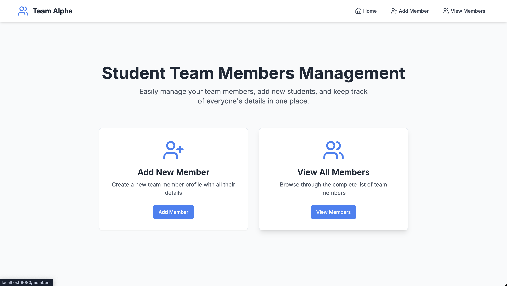
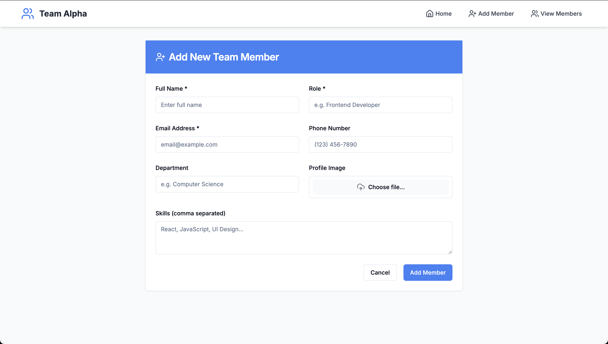

# 🌟 Team Alpha - Web Application

Welcome to the **Team Alpha** frontend project! This is a modern, fast, and responsive web application built with **Vite**, **React**, **TypeScript**, and **Tailwind CSS**.

---

## 🚀 Tech Stack

- **Vite** – Lightning-fast build tool
- **React** – JavaScript library for building UI
- **TypeScript** – Typed JavaScript
- **Tailwind CSS** – Utility-first CSS framework
- **PostCSS** – CSS transformation
- **ESLint** – Linter for code quality

---

## 📦 Getting Started

### Prerequisites

Make sure you have the following installed:

- **Node.js** (v16 or higher)
- **npm** (v8 or higher)

### Installation

```bash
git clone https://github.com/AnshHosabettu/team-alpha.git
cd team-alpha
npm install
```
---




